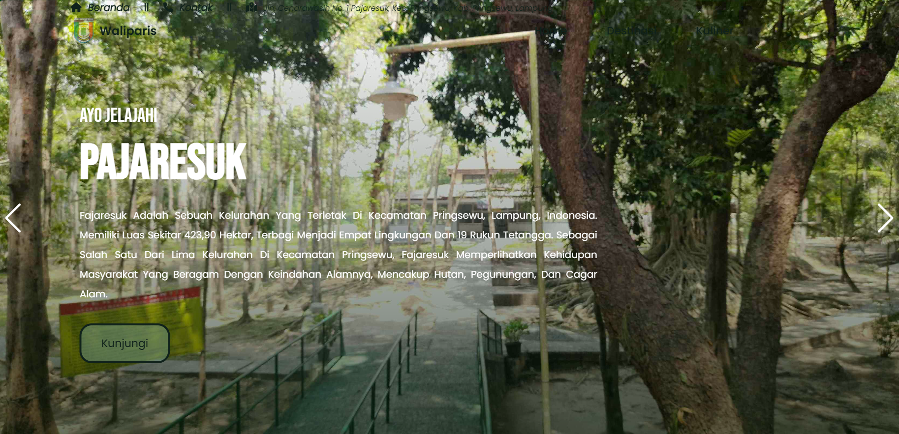
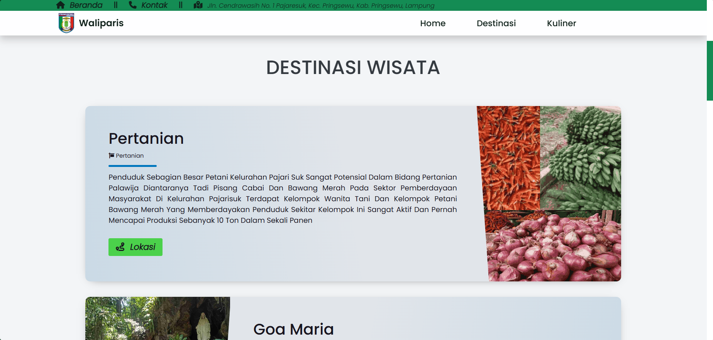

# Waliparis - Pajaresuk Tourism Website

A responsive tourism website showcasing the attractions, culinary offerings, and cultural heritage of Pajaresuk Village in Pringsewu, Lampung, Indonesia.

## Website

[_Click this_](https://1wikii.github.io/project-desa-pajaresuk/)

## Overview

This project presents the tourism potential of Pajaresuk Village through an interactive and user-friendly website. The site highlights various destinations, local cuisine, and cultural attractions available in the area.

## Features

- Responsive design for all device sizes
- Interactive navigation
- Image sliders for featured attractions
- Detailed information about tourist destinations
- Local culinary highlights
- Maps integration for location services
- Contact information and social media links

## Tech Stack

- HTML5
- CSS3
- JavaScript
- Swiper.js for image sliders
- Font Awesome for icons
- Google Maps integration

## Screenshots

Main Page

    

Destination Page

    

## Social Media

- [Facebook](https://www.facebook.com/kelurahan.pajaresuk)
- [Instagram](https://instagram.com/kelurahanpajaresuk.psw)
- [YouTube](https://youtu.be/J6-6Ch7OJZk)

## Copyright

Copyright ©️ 2023 - Kelurahan Pajaresuk
